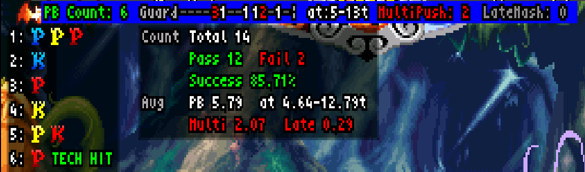

# VSAV_Training - The Warlord's Secret

See what the Warlord sees, and practice what the Warlord practices, in VSAV training mode for Fightcade 2.

[English](README.md) | 日本語

**内部フレーム（Tick）単位で相手の動きを再現し、攻めの検証と守りの練習に使える、Fightcade 2／FBNeo用トレーニングモードです。** 入力や攻防のタイミングを可視化し、成功・失敗の理由を確認しながら練習できます。

[VSAV_Trainingのfc2ブランチ](https://github.com/NBeing/VSAV_Training/tree/fc2)を基に拡張したフォークです。本書の対象は **v11.7.19** です。

**[ダウンロード](https://github.com/vampiresavior001/VSAV_Training/archive/refs/heads/fc2-v11.zip)** · [導入](#windowsでの導入) · [最初のAG・GC練習](#first-ag-drill) · [日本語マニュアル](docs/PLAYER_MANUAL.ja.md)

## Tick単位で、再現・検証・改善する

Tickはゲームの内部フレームです。

**自分では難しい操作も、定義するだけでダミーに再現させられます。** レコーディングでは、相手キャラクターの動きを自分で操作して録る必要があります。Action Stepsなら、「最速ダッシュからの最速攻撃」「中足払いキャンセル天雷破」といった難しい行動も、動作とタイミングを指定して再現できます。達人の動きを練習相手にして、AG・GCや割り込みを繰り返し練習できます。

| ゲーム速度 | 表示フレームと内部フレームの関係 |
|---|---|
| ノーマル | 表示1フレーム＝1 Tick |
| ターボ3 | 表示3フレーム＝4 Tick |

本フォークは内部フレームに合わせて入力を制御し、フォーク元で制約のあった反撃タイミングの再現を改良しています。起き上がり・ガード後・着地後に、必殺技のリバーサルだけでなく、**小技・投げによる暴れ、ジャンプ、ダッシュ**も指定できます。

**相手の動きを再現する → 自分の対処を試す → 表示で原因を確認する → タイミングを変えて練習する。** 正確な動作指定と詳しい振り返りを組み合わせ、攻めと守りの両方を磨くことが本フォークの狙いです。行動ごとの最速入力の条件は[Action Steps](docs/PLAYER_MANUAL.ja.md#06-steps)を参照してください。

## 何を調べ、練習できるか

| 目的 | 使い方 |
|---|---|
| **攻めが通る条件を調べる** | ダミーに小技・投げ・ジャンプ・ダッシュで対応させ、連係や起き攻めがそれらに勝つか検証する |
| **連係やコンボを正確に再現する** | Action StepsでTick単位の動きを定義し、Action Patternsで保存・ランダム実行・共有する。バレッタやビシャモンの永久コンボを完遂するような定義も可能 |
| **セットプレイの時間を調べる** | Tick DataのAction Timelineで、起き攻めのフレーム消費や、15表示フレーム（ターボ3では20 Tick）以内に歩き投げを仕掛けられる開始距離を検証する |
| **AG（アドバンシングガード）を練習する** | なるべく遅らせて受付内に6回の有効入力を収める練習。入力タイミング・同時押し・受付終了後の入力と、平均・成功率を確認する |
| **GC（ガードキャンセル）を練習する** | ゲームが受け付けた方向・ボタン・入力間隔を確認し、コマンドの失効や入力の遅れを調べる |
| **空中ガード後の攻防を調べる** | 空中チェーンの割り込める隙間、実際の割り込みタイミング、空中ガードした時点、着地後の有利不利を確認する |

**Tick Data**は、従来の表示フレーム単位の測定で生じていたターボによる数値の揺れを抑え、発生・持続・戻り・有利不利の数え方・考え方を攻略サイトのフレームデータに合わせています。測定条件とAction Timelineの読み方は[マニュアル10章](docs/PLAYER_MANUAL.ja.md#10-data)で説明しています。

### 入力が「どうなったか」を見る

この例では、受付の5～13 Tick目に6回入力してAGが成立しています。同時押しがあったTickは2つ、受付終了後の入力は0です。**成立したかだけでなく、どこを改善するかまで確認できます。** 英語UIのPush Block／PBはAGを指します。詳しい読み方は[AG練習](docs/PLAYER_MANUAL.ja.md#08-pb)へ。

### 手軽な録画と、精密な動作指定を使い分ける

本フォークで追加した**Recording Wizard**は、操作開始から終了までを簡単に録画する機能です。最初の入力で開始し、動作と入力が終わると自動終了。確認再生してから保存でき、ループ・ランダム再生で反復練習に使えます。

**録画・再生は表示フレーム単位です。Tick単位の入力タイミングを正確に指定する練習にはAction Stepsを使ってください。**

## 導入前に：Run-aheadは必ずOFF

**Run-aheadがONのままでは、トレーニングスクリプトの挙動が不正になります。**

Fightcadeで対戦もする場合は、設定の切り替え忘れを防ぐため、**`emulator/fbneo`フォルダー以下を丸ごと複製し、トレーニング専用環境を作ってください。** 複製先でRun-aheadをOFFにし、対戦用と練習用の起動先・設定を分けます。

| 用途 | 起動方法 |
|---|---|
| 対戦 | 通常のFightcadeから起動 |
| トレーニング | 複製先の`run_vsav_training.bat`から起動。Run-aheadはOFF |

## Windowsでの導入

対象ゲームは **Vampire Savior - the lord of vampire（970519 Japan／`vsavj`）** です。

**ROMは含まれません。各自で用意し、先にFBNeoでゲームが起動できる状態にしてください。**

1. FightcadeとFBNeoを終了します。
2. Fightcadeの`emulator/fbneo`フォルダー全体を、別の場所へコピーします。例：`C:/VSAV_Training/fbneo`。
3. 本プロジェクトをダウンロードして展開し、`run_vsav_training.bat`と`scripts`フォルダー全体を、**複製先のfbneoフォルダー**へ配置します。バッチファイルは`fcadefbneo.exe`と同じ階層に置きます。
4. 複製先の`run_vsav_training.bat`を起動し、**Run-aheadをOFF**にします。元の設定もコピーされるため、複製するだけではOFFになりません。
5. FBNeoを完全終了して同じバッチから再起動し、Run-aheadがOFFのままであることを確認します。
6. `Input > Map Game Inputs`でゲーム操作と下表の機能を割り当てます。P2側のゲーム入力も設定してください。

全画面で遊ぶときは、先に`Video > Blitter options > Windowed Fullscreen`にチェックを入れてください。古い形式の全画面では、パターンの名前入力やExport・Importのウィンドウを表示できません。

配置先は、空白や日本語を含まない短いパスを使用してください。既存環境を更新する場合は、先に[バックアップ](#更新とバックアップ)を行います。

### 基本操作

**`Lua Hotkey 1`と`P1 Coin`はメニューで代用できないため、必ず割り当ててください。** ほかの項目は、下表のメニュー操作で代用できます。

ボタン一覧とメニューでの代用操作を開く

| FBNeoの入力項目 | 機能 | メニューでの代用操作 |
|---|---|---|
| `Lua Hotkey 1` | トレーニングメニューを開閉 | 代用不可・**必須** |
| `Lua Hotkey 2` | レバーとの組み合わせで位置を戻す | `Dummy > Position`で左右を押して配置を選ぶ。LPで同じ配置に戻す。HPなら戻してメニューも閉じる |
| `Lua Hotkey 3` | 録画のループ再生を切り替える | `Recording > Looped Playback`を左右で`yes`／`no`に切り替える |
| `Lua Hotkey 4` | キャラクター選択へ戻る | `Game > Return to Character Select`で右またはLP |
| `Volume Up` | 通常録画の開始・終了 | `Recording > Recording Wizard`で右またはLP。スロットを選び、自動録画で代用する（下記参照） |
| `Volume Down` | 録画の再生・停止 | `Recording > Play Recording`で右またはLP。もう一度実行すると停止 |
| `P1 Coin` | 試合中は操作側を切り替え。キャラ選択中はステージ選択 | 代用不可・**必須** |

メニューは`Lua Hotkey 1`で開き、上端のタブ名で左右を押してタブを切り替え、上下で項目を選びます。LPは弱Pです。`>`は「タブ > 項目」の順を表します。

**録画をメニューで代用する場合：** ウィザードでスロットを選び、いったん入力を離してから操作すると録画が始まります。操作を終えて入力を離し、ダミーが動ける状態で約2秒待つと自動終了します。確認画面で保存を選び、LPで決定してください。手動で開始・終了を指定したい場合は`Volume Up`を使います。

録画の`Looped Playback`と、Action Stepsの`Loop Steps`は別の設定です。[録画の詳しい手順](docs/PLAYER_MANUAL.ja.md#05-recording)も参照してください。

`Volume Up / Down`はFBNeoの入力項目名です。アーケードコントローラーなどのボタンにも割り当てられます。

## 最初の練習：サスカッチを相手にAG・GCを練習する

サスカッチにショートダッシュ小Pをさせて、AG（アドバンシングガード）とGC（ガードキャンセル）を練習します。最後に、その動きを保存して次回も使えるようにします。

1. **作る。** ダミーをサスカッチにし、`Reversal - Action Steps`で`Dash > Forward Cancel`（`Auto (Fastest)`）→LP（`Auto (8)`）を定義します。
2. **AGする。** こちらの技をガードさせて反撃を始め、その小PにAGします。PB Counter／PB Statsで、遅らせながら受付内に6回入力できたか確認します。
3. **GCも試す。** 同じ小Pに自キャラのGCを入力し、成功表示と、受け付けられた方向・ボタン・入力間隔を確認します。
4. **連続で練習する。** `Loop Steps = yes`、`Loop Wait = Auto (Landing)`にして、着地からショートダッシュ小Pを繰り返させます。
5. **保存する。** Action Patternsの`Add from current Steps`で`Short LP`として保存します。別の攻めも登録すれば、複数候補のランダム練習へ発展させられます。

**[設定からAG・GC表示の読み方・ループ・保存までの手順](docs/PLAYER_MANUAL.ja.md#sasquatch-ag-tutorial)**に沿って進めてください。最初は一回ずつ試し、慣れたら連続で練習しましょう。

## マニュアル

**[日本語プレイヤーマニュアル](docs/PLAYER_MANUAL.ja.md)** に、操作・設定・表示の読み方をまとめています。

- [ダミーのガード・受け身・反撃](docs/PLAYER_MANUAL.ja.md#04-dummy)
- [録画とループ再生](docs/PLAYER_MANUAL.ja.md#05-recording)
- [Action Steps](docs/PLAYER_MANUAL.ja.md#06-steps)／[Action Patterns](docs/PLAYER_MANUAL.ja.md#07-patterns)
- [AG練習](docs/PLAYER_MANUAL.ja.md#08-pb)／[GC練習](docs/PLAYER_MANUAL.ja.md#09-gc)
- [Tick Data・空中ガードの分析](docs/PLAYER_MANUAL.ja.md#10-data)
- [目的別の練習レシピ](docs/PLAYER_MANUAL.ja.md#11-drills)
- [困ったとき](docs/PLAYER_MANUAL.ja.md#14-troubleshooting)

### 対応範囲

このREADMEの導入手順はWindows向けです。Linux用の起動スクリプトも同梱していますが、本フォークの全機能についてLinux／macOSで動作することは、このREADMEの作成時には確認していません。Action Patternsの名前入力・ファイル選択はWindows向けの実装です。

時間表示には、内部フレームを使うものと表示フレームを使うものがあります。ダッシュ系の既存トレーナーなども含め、すべての表示がTickに統一されているわけではありません。単位は[マニュアル](docs/PLAYER_MANUAL.ja.md#10-data)を確認してください。

## 更新とバックアップ

FBNeoを終了する前に編集内容を保存し、次のファイルをバックアップしてください。

| 内容 | 保存先 |
|---|---|
| 設定・Action Steps・Action Patterns | `scripts/training_settings.json` |
| 録画 | `scripts/macro`フォルダー全体 |

更新はトレーニング専用の複製先へ行います。配布物に録画ファイルが含まれる場合があるため、自分の録画を不用意に上書きしないでください。更新後はFBNeoを完全に再起動し、Run-aheadがOFFであることも確認します。

## 変更履歴・不具合報告

- [日本語リリースノート](docs/RELEASE_NOTES.ja.md)
- [Release notes (English)](docs/RELEASE_NOTES.md)
- [このフォークのIssues](https://github.com/vampiresavior001/VSAV_Training/issues)

不具合を報告する際は、バージョン、P1／P2キャラクター、左右配置、設定画面、再現手順を添えてください。トレーニング用FBNeoのRun-aheadがOFFであることも確認してください。

## フォーク元・クレジット

本プロジェクトは、[VSAV_Trainingのfc2ブランチ](https://github.com/NBeing/VSAV_Training/tree/fc2)を基にしています。フォーク元にも録画・反撃設定・AGカウンター・GC受付表示があります。本フォークはそれらを土台に、動作再現の精度と振り返りの詳しさを拡張しています。[機能比較](docs/PLAYER_MANUAL.ja.md)も参照してください。基盤となるトレーニングモードと、各スクリプトを作成・改善してきた貢献者、VSAVコミュニティに感謝します。

フォーク元READMEのクレジット

Shoutouts to: Dammit and Jed for their wizardry, Grouflon (Stole their 3s training mode menu, and settings workflow!) and the VSAV Community.

BIGGEST SHOUTOUT to KyleW! This definitely would not have happened or continued without you.

`N-Bee`

